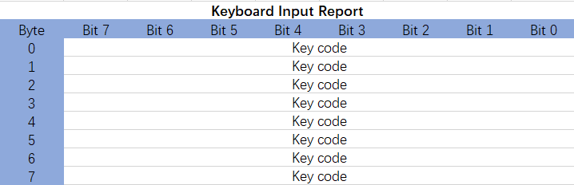
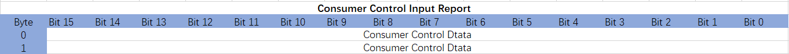
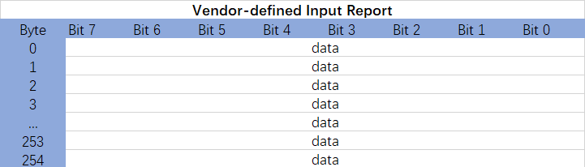
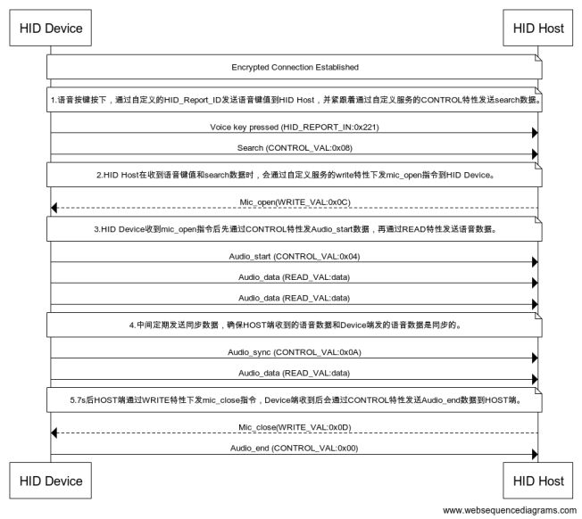
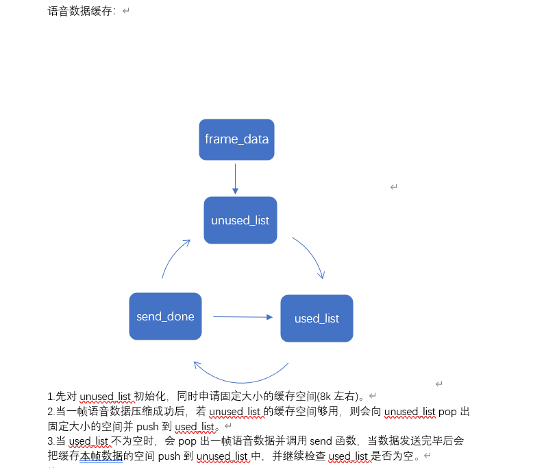

BLE_HID_DMIC（HID设备间的语音数据交互）示例说明
=======================================================

例程路径：<install_file>/dev/examples/ble/ble_hid_dmic

一、示例基本说明、配置及流程:
-----------------------------

关于普通服务的添加可以参考ble_uart_server示例说明，关于配对加密绑定流程可以参考BLE工作流程中关于GAP的介绍，这里重点介绍和语音数据处理相关的功能。

1.1基本说明
++++++++++++++++++++++++++++++++
关于hid：
 HID设备是通过报告(Report)来给传送数据的，报告有输入特性(Input)、输出特性(Output)和Feature特性。输入特性是HID设备发送数据到主机，类似notify特性；输出特性是主机发送数据到HID设备，类似Write特性；Feature特性有输入和输出特性。

关于报告描述符：
 报告描述符(Report Descriptor)是用来描述HID设备中的报告以及报告里面的数据怎么用的。一个报告描述符可以描述多个报告，不同的报告通过Report ID来识别。通过报告描述符，主机可以分析出报告里面的数据所表示的意思。

.. code ::

    const uint8_t hid_report_map[] =
    {
        0x05, 0x01, //Usage Page(Generic Desktop) Usage Page用来指定HID设备的某功能项,Usage Page相当于是HID用途的子集合。
        0x09, 0x06, //Usage(Keyboard) Usage用来指定Usage Page的某功能项,Usage相当于是Usage Page的子集合。
        0xA1, 0x01, //Collection(Application) 
        0x05, 0x07, //Usage Page(Keyboard)
        0x09, 0x06, //Usage(Keyboard c and C)
        0xA1, 0x01, //Collection(Application) 集合项和End Collection搭配使用。
        0x85, 0x01, //Report Id(1) 报告id号，由报告id生成对应的句柄进行数据交互。
        0x95, 0x08, //Report Count(8) 用来设定告字段的数目，和Report Size搭配使用。
        0x75, 0x08, //Report Size(8)  用来设定报告字段的大小，单位是位(bit)。
        0x15, 0x00, //Logical minimum(0) 报告字段的最小逻辑数值范围，与上面的Report Size相对应。
        0x25, 0xFF, //Logical maximum(255)报告字段的最大逻辑数值范围，即一个报告字段(8 bits)能表示的最大逻辑值为255。
        0x19, 0x00, //Usage Minimum(No event indicated)用来表示Usage(Keyboard)功能项中使用Key Codes的最小键值范围，和Usage搭配使用。
        0x29, 0xFF, //Usage Maximum(Reserved (0x00FF))用来表示Usage(Keyboard)功能项中使用Key Codes的最大键值范围，和Usage搭配使用。
        0x81, 0x00, //Iuput(Data,Array,Absolute,Bit Field)表示数据到主机的数据格式。
        0xC0,       //End Collection 集合项的结束标志

        0x05, 0x0C,       //Usage Page(Consumer)
        0x09, 0x01,       //Usage(Consumer Control)
        0xA1, 0x01,       //Collection(Application)
        0x85, 0x03,       //Report Id(3)
        0x19, 0x00,       //Usage Minimum(No event indicated)
        0x2A, 0x9D, 0x02, //Usage Maximum(Reserved (0x029D))
        0x15, 0x00,       //Logical minimum(0)
        0x26, 0x9D, 0x02, // Logical maximum(669)
        0x75, 0x10,       //Report Size(16)
        0x95, 0x02,       //Report Count(2)
        0x81, 0x00,       //Iuput(Data,Value,Absolute,Bit Field)
        0xC0,             //End Collection

        0x06, 0x00, 0xFF, //Usage Page(Vendor-defined 0xFF00)
        0x09, 0x00, //Usage(Vendor-defined 0x0000)
        0xA1, 0x01,       //Collection(Application)
        0x85, 0x5A,       //Report Id(90)
        0x95, 0xFF, //Report Count(255)
        0x75, 0x08, //Report Size(8)
        0x15, 0x00, //Logical minimum(0)
        0x25, 0xFF, //Logical maximum(255)
        0x19, 0x00, //Usage Minimum(No event indicated)
        0x29, 0xFF, //Usage Maximum(Reserved (0x00FF))
        0x81, 0x00,       //Iuput(Data,Value,Absolute,Bit Field)
        0xC0,             //End Collection
        0xC0,             //End Collection
    };

.. note ::

    上面的描述符(descriptor)指定了以下报告(report)。

1.2基本配置
++++++++++++++++++++++

关于hid的service配置和hid profile的添加：

.. code ::

    struct hid_db_cfg db_cfg;///配置hid结构体变量
        db_cfg.hids_nb = 1;///默认配置hid的个数为1
        db_cfg.cfg[0].svc_features = HID_PROTO_MODE;///配置为report模式
        db_cfg.cfg[0].report_nb = 3;///配置report的个数，依据于report map
        db_cfg.cfg[0].report_id[0] = 1;///配置report的索引号与report id的关系，发数据时根据report的索引号找到相应的report id
        db_cfg.cfg[0].report_id[1] = 3;
        db_cfg.cfg[0].report_id[2] = 90;

        db_cfg.cfg[0].report_cfg[0] = HID_REPORT_IN;///report索引号对应的report id特性
        db_cfg.cfg[0].report_cfg[1] = HID_REPORT_IN;
        db_cfg.cfg[0].report_cfg[2] = HID_REPORT_FEAT;

        db_cfg.cfg[0].info.bcdHID = 0;///HID的规格发布号，默认为0
        db_cfg.cfg[0].info.bCountryCode = 0;///默认为0
        db_cfg.cfg[0].info.flags = HID_WKUP_FOR_REMOTE;///配置为远程可唤醒设备
        dev_manager_prf_hid_server_add(NO_SEC, &db_cfg, sizeof(db_cfg));///添加hid profile的函数调用

.. note ::

    1.hid服务添加成功之后会在dev event:PROFILE_ADDED中调用prf_added_handler函数，然后初始化hid事件处理的回调函数：prf_hid_server_callback_init(prf_hid_server_callback)。
    2.关于pdm的配置参考dev/examples/peripheral/pdm。

1.3 事件处理
+++++++++++++++++++++

关于hid的事件处理回调函数：prf_hid_server_callback

.. code ::

    static void prf_hid_server_callback(enum hid_evt_type type, union hid_evt_u *evt, uint8_t con_idx)
    {
        uint16_t ntf_cfg;
        switch (type)
        {
        case HID_REPORT_READ:///回复主机read hid设备的特性
            evt->read_report_req.length = 0;  
            if(evt->read_report_req.type == APP_HOGPD_REPORT_MAP)
            {
                evt->read_report_req.value = (uint8_t *)hid_report_map;// 主机读取report map信息
                evt->read_report_req.length = HID_REPORT_MAP_LEN;
            }
            break;
        case HID_NTF_CFG:///回复主机读hid ntf_cfg的配置值
            LOG_I("hid_ntf_cfg save flash record_key1 : %x",evt->ntf_cfg.value);
            ntf_cfg = evt->ntf_cfg.value; 
            tinyfs_write(hid_dir, RECORD_KEY1, (uint8_t*)&ntf_cfg, sizeof(ntf_cfg));
            tinyfs_write_through();
            break;
        case HID_NTF_DONE:///hid设备调用app_hid_send_keyboard_report函数，发送完数据后的处理
            LOG_I("HID NTF DONE");
            break;
        case HID_REPORT_WRITE:///回复主机write hid设备的特性
            LOG_I("HID REPORT WRITE");
            break;   
        default:
            break;
        }
    }

1.4 主从机数据交互流程
++++++++++++++++++++++++++++

1.5 语音数据缓存处理
++++++++++++++++++++++++++++++

二、特别说明:
-------------------------
通过PDM调制输出PCM数据流后对压缩算法的要求：

2.1 谷歌ADPCM压缩格式要求：
++++++++++++++++++++++++++++++

2.1.1 采样数据速率：8Khz/16Khz--16bit，即1ms有8*16bit/16*16bit PCM的数据。

2.1.2 压缩比：PCM->ADPCM为4:1，即1ms有4bytes/8bytes ADPCM的数据。​

2.1.3 Header：
    Aduio frame Number：2 bytes 

    remote control id：1 byte

    previous predicted ADPCM value：2 bytes 

    Index into step size table：1 byte 

2.1.4 Payload：
    adpcm data：128 bytes 

2.2 三星MSBC压缩格式要求：
++++++++++++++++++++++++++++++

2.2.1 采样数据速率：16Khz--16bit，即1ms有16*16bit PCM的数据。

2.2.2 压缩比：PCM->MSBC为4:1，即1ms有8bytes MSBC的数据。​

2.2.3 Header：
    Frame Num：1byte

    Frame start flag：3bytes(固定为0xAD,0x00,0x00)

    CRC：1byte

    Scaler factor：4bytes

2.2.4 Payload：
    msbc data：49bytes

