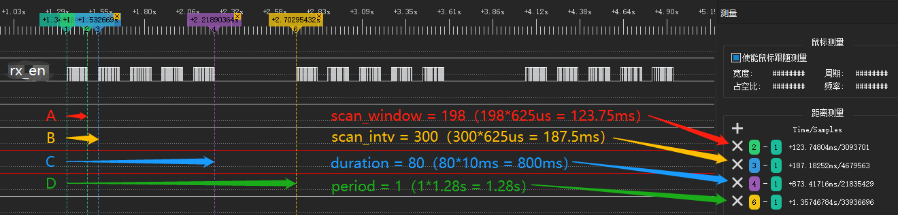
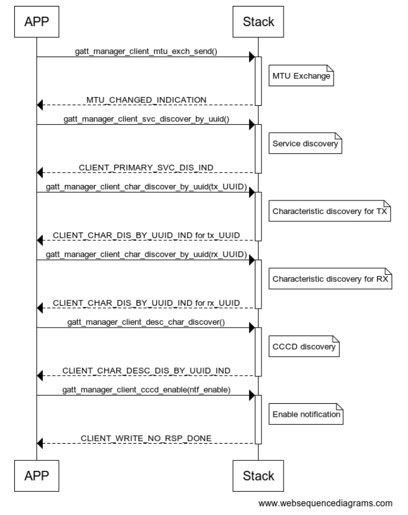
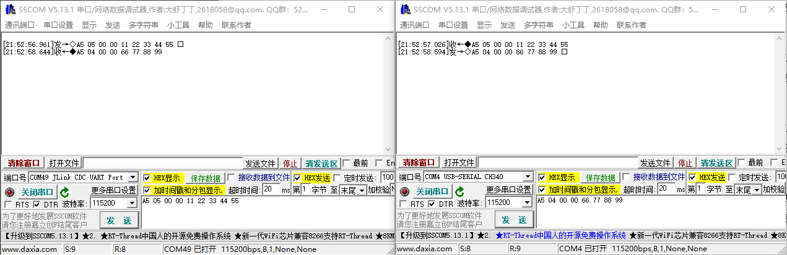

BLE_SINGLE_ROLE（单主/单从/一主一从串口透传）示例说明
=======================================================

例程路径：<install_file>/dev/examples/ble/ble_single_role

一、示例基本配置、流程及说明:
-----------------------------

根据不同配置，BLE_SINGLE_ROLE可以是一个单主机、单从机，或者一主一从的主从一体串口透传实例。从机与主机的功能是相互独立的，而从机的功能和Uart_Server基本一致，因此这里重点介绍单主机（MASTER_CLIENT_ROLE=1）功能。

1.1 准备工作之一：初始化
++++++++++++++++++++++++++++++++
与Uart_Server一样，串口透传需要先初始化串口相关功能模块，包括软件定时器。调用的相关接口如下：

.. code ::

        ls_uart_init(); // 串口模块初始化
        ls_app_timer_init(); // 初始化软件定时器
        HAL_UART_Receive_IT(&UART_Config, &uart_rx_buf[0], UART_SYNC_BYTE_LEN);  // 串口接收使能，每次接收1byte，存放到uart_rx_buf的最开始  
		
串口参数默认配置IO为PB00/PB01，波特率为115200，具体可以参考ls_uart_init()的实现。软件定时器周期配置为50ms。这些都与Uart_Server一致
除此之外，与BLE连接和GATT Client相关的数据结构也需要初始化：

.. code ::

        ls_uart_client_init(); 

这其中主要包括con_id/handle/MTU的初始化等

1.2 打开Scan/建立连接
++++++++++++++++++++++
BLE相关的操作，作为主机，需要首先调用create_scan_obj()创建扫描对象。当scan object创建完成后，协议栈会产生一个SCAN_OBJ_CREATED消息，在这个消息的处理函数里，应用需要调用create_init_obj()再创建一个发起连接的对象。在两个对象都创建完成后，打开scan，扫描空中的广播数据。函数具体实现为：

.. code ::

    static void start_scan(void)
    {
        LS_ASSERT(scan_obj_hdl != 0xff);
        struct start_scan_param scan_param = {
            .scan_intv = 100*3,
            .scan_window = 66*3,
            .duration = 80,
            .period = 1,
            .type = OBSERVER,
            .active = 0,
            .filter_duplicates = 0,
        };
        dev_manager_start_scan(scan_obj_hdl, &scan_param);
    }

scan的参数比较多，重点解释一下与时间相关的参数，如下图所示：
    

上图为映射到IO的硬件rx_en信号，其中高电平表示RF处于接收状态。

1、scan_window表示单次scan开启的窗口大小，单位为625微秒，如图中A所示。

.. note ::

    在单个scan_window内，rx_en会有频繁的拉高拉低，其产生的原因是周边环境里有大量广播设备，RF多次同步到空中的ADV Access Address信号(0x8E89BED6)，每次sync成功都会导致rx_en信号的拉低，之后硬件又会自动拉高rx_en继续接收

2、scan_intv表示一个duration内，相邻两次scan窗口开启间隔，单位为625微秒，如图中B所示。**scan_intv必须大于等于scan_window，否则协议栈会报错**

3、duration为一次scan事件的持续时间，单位为10ms。如果配置为0，意味着scan事件不会终止，指导收到应用层面的终止命令。由于每次开启scan都要持续scan_window这么长的时间，因此duration的计时不会很准确

4、period为连续两次scan事件之间的间隔，单位为1.28s

其余的参数解释如下：

5、type表示scan类型，可以配置的选项解释如下：

GENERAL_DISCOVERABLE：表示只能发现adv flag里有general_discovery或limited_discovery标志的广播包，同时该scan类型的duration实际为10.24秒，period为0

LIMITED_DISCOVERABLE：表示只能发现adv flag里有limited_discovery标志的广播包，同时该scan类型的duration实际为10.24秒，period为0

OBSERVER：表示最普通的scan，限制条件最少。除了受filter_duplicates的配置影响外，所有的adv包都会被接收

OBSERVER_WHITELIST：表示只有在白名单里的设备发送的广播包才会被接收

CONNECTABLE：表示只接收可连接广播包

CONNECTABLE_WHITELIST：表示只接收在白名单里的可连接广播包

6、active表示是否会发送scan request

7、filter_duplicates表示是否对重复地址的广播包进行过滤操作

在single_role示例里，scan type为OBSERVER。当收到的广播包地址与期望值匹配时，在ADV_REPORT消息里，会停止当前的scan，而在随后的SCAN_STOPPED消息里，应用会调用start_init()发起连接：

.. code ::

    static void start_init(uint8_t *peer_addr)
    {
        struct dev_addr peer_dev_addr_str;
        memcpy(peer_dev_addr_str.addr, peer_addr, BLE_ADDR_LEN);
        struct start_init_param init_param = {
            .scan_intv = 64,
            .scan_window = 48,
            .conn_to = 0,
            .conn_intv_min = 16,
            .conn_intv_max = 16,
            .conn_latency = 0,
            .supervision_to = 200,

            .peer_addr = &peer_dev_addr_str,
            .peer_addr_type = dev_addr_type,
            .type = DIRECT_CONNECTION,
        };
        dev_manager_start_init(init_obj_hdl,&init_param);
    }

其中scan_intv/scan_window的含义与scan的参数含义一致。

conn_to：表示connection timeout，表示尝试连接的超时时间，以10ms为单位。设置为0表示没有超时时间。注意该参数只有在type为AUTO_CONNECTION_WHITELIST时才生效

.. note ::

    start_init里的type为DIRECT_CONNECTION时，假如需要对init行为增加timeout，需要使用额外的timer（比如builtin timer或外设timer），
    在timeout触发时调用dev_manager_stop_init结束init行为

conn_intv_min：表示最小连接间隔，以1.25ms为单位，容许的范围是7.5ms到4s

conn_intv_max：表示最大连接间隔，以1.25ms为单位，容许的范围是7.5ms到4s

conn_latency：表示slave latency，连接建立之后，slave可以连续不回应的事件个数

supervision_to：表示supervision timeout，以10ms为单位，容许的范围是100ms到32s

peer_add：表示待连接的设备地址

peer_addr_type：表示待连接的设备地址类型，0表示public，1表示random

type：表示连接类型。DIRECT_CONNECTION表示连接peer_addr和peer_addr_type指定的设备，AUTO_CONNECTION_WHITELIST表示主机会尝试与所有在白名单里的设备自动建立连接

在建立连接成功之后，协议栈会产生一个GAP的CONNECTED消息到应用层，demo里会在这个消息里调用gatt_manager_client_mtu_exch_send()进行MTU交换，进而触发GATT层的后续行为。

1.3 GATT服务发现流程
+++++++++++++++++++++

single_role demo的服务发现流程如下图：

服务发现流程主要遵循如下流程：

step 1：主服务发现，调用gatt_manager_client_svc_discover_by_uuid()接口，之后应用会收到CLIENT_PRIMARY_SVC_DIS_IND消息

step 2: TX特征值发现：调用gatt_manager_client_char_discover_by_uuid()接口，TX UUID作为参数，之后应用会收到CLIENT_CHAR_DIS_BY_UUID_IND消息

step 3: RX特征值发现：调用gatt_manager_client_char_discover_by_uuid()接口，RX UUID作为参数，之后应用会收到CLIENT_CHAR_DIS_BY_UUID_IND消息

step 4：CCCD发现：调用gatt_manager_client_desc_char_discover()接口，之后会收到CLIENT_CHAR_DESC_DIS_BY_UUID_IND消息

step 5：CCCD使能：调用gatt_manager_client_cccd_enable()接口，其中notification设置为enable，indication设置为disable。实际为write no rsp操作，所以会收到CLIENT_WRITE_NO_RSP_DONE消息

至此所有的Uart Server服务发现全部完成。

二、示例验证步骤及结果:
-------------------------
single_role的master和slave建立连接后，通过PC端串口助手连接两个设备的Uart，分别发送固定格式的数据，可以看到对端能收到相应数据，如下图所示：

三、特别说明:
-------------------------

1、关于串口透传数据格式说明
+++++++++++++++++++++++++++++++

在Uart Server demo里，串口上的数据是完全没有格式的，因此每次只需要接收1个byte，累积的数据在定时器里周期性发送出去。而在single role demo里，由于有可能有多连接（一主一从），因此需要通过connection id来区分。这就要求串口过来的数据必须指明接收的connection对端，进而要求串口传输的数据有一定的数据格式。在single role demo里，串口数据格式是sync_byte(1byte, 默认0xA5)+length(2bytes)+connection_id(1byte)+data(length bytes)

