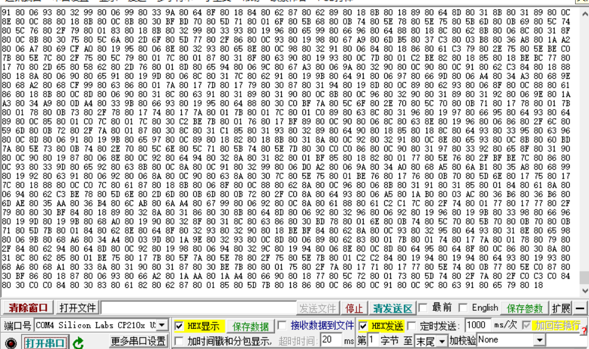

PDM使用示例
=============

 | 1. PDM（Pulse Density Modulation）是一种用数字信号表示模拟信号的调制方法。PDM只有1位数据输出，要么为0，要么为1。
 | 2. PDM把数字麦克风采样的数据会放置在PCM数据寄存器的0-15位中，可以通过DMA或者PDM中断的方式去收集pdm采样到的实时数据。
 | 3. 此测试用例是通过DMA的乒乓模式来搬运PDM数据流并通过DMA基本模式把PDM数据打印到串口助手上。

一、串口配置
----------------

 | 1. 包含io_config和lsuart头文件。
 | 2. 定义UART句柄，并调用HAL_UART_Init初始化函数。通过DMA搬运数据到串口助手上时，需要在uart初始化的时候同时配置uart所使用的dma对象和dma通道。
 | 3. 默认使用UART1并把PB00、PB01作为通讯串口，其中PB00为模块的TX，PB01为模块的RX，默认的uart口的配置参数为： 波特率 500000、无校验、8位数据位、1位停止位。

.. code ::

    #include "io_config.h"
    #include "lsuart.h"
    static UART_HandleTypeDef UART_PDM_Config; 
	static void ls_pdm_uart_init(void)
	{
		uart1_io_init(PB00, PB01); //uart io 初始化函数
		UART_PDM_Config.UARTX = UART1;
		UART_PDM_Config.DMAC_Instance = &dmac1_inst; //uart选择的dma对象
		UART_PDM_Config.Tx_Env.DMA.DMA_Channel = 3; //uart选择的dma通道号
		UART_PDM_Config.Init.BaudRate = UART_BAUDRATE_500000;
		UART_PDM_Config.Init.MSBEN = 0;
		UART_PDM_Config.Init.Parity = UART_NOPARITY;
		UART_PDM_Config.Init.StopBits = UART_STOPBITS1;
		UART_PDM_Config.Init.WordLength = UART_BYTESIZE8;
		HAL_UART_Init(&UART_PDM_Config);
	}

二、PDM配置
----------------

 | 1. 包含lspdm头文件。注意：io_config文件在UART配置的时候已经包含。
 | 2. 定义PDM句柄，并调用HAL_PDM_Init初始化函数。
 | 3. 通过GPIO复用模式把PB10复用为数字麦克风的CLOCK引脚，PB09复用为数字麦克风的DATA引脚。
 | 4. 把PDM句柄中的实例对象映射到PDM寄存器的基址中，并对PDM寄存器进行赋值。
 | 5. 把PDM时钟速率设为1.024MHZ，采样率设为16KHZ，延时捕捉为30个周期，数据增益设为5，采用单声道模式。
 | 6. 选择PDM的DMA对象、PDM的DMA通道选择、配置DMA乒乓模式下交替存放FRAME_BUF_SIZE大小PDM数据的两个数组。

.. code ::

    #include "lspdm.h"
	#define PDM_CLK_KHZ 1024    //默认使用1.024MHZ的时钟速率
	#define PDM_SAMPLE_RATE_HZ 16000    //默认使用16KHZ采样
	#define FRAME_BUF_SIZE 256
	PDM_HandleTypeDef pdm;//pdm句柄定义
	DMA_RAM_ATTR uint16_t Buf0[FRAME_BUF_SIZE]; //dma乒乓模式下交替接受pdm数据buf0的定义
	DMA_RAM_ATTR uint16_t Buf1[FRAME_BUF_SIZE]; //dma乒乓模式下交替接受pdm数据buf1的定义
	static struct PDM_PingPong_Bufptr pdm_data_receive;
	void pdm_init()
	{
		pdm_clk_io_init(PB10);
		pdm_data0_io_init(PB09);
		pdm.Instance = LSPDM; //LSPDM表示pdm外设的基址，在lspdm.h中已经定义
		PDM_Init_TypeDef Init = 
		{
			.fir = PDM_FIR_COEF_16KHZ,
			.cfg = {
				.clk_ratio = PDM_CLK_RATIO(PDM_CLK_KHZ), //pdm时钟配置
				.sample_rate = PDM_SAMPLE_RATE(PDM_CLK_KHZ,PDM_SAMPLE_RATE_HZ), //pdm采样速率配置
				.cap_delay = 30, //延时捕捉
				.data_gain = 5, //数据增益
			},
			.mode = PDM_MODE_Mono, //单声道模式
		};
		pdm.DMAC_Instance = &dmac1_inst; //pdm选择的dma对象
		pdm.Env.DMA.Channel[0] = 1; //dma通道选择
		pdm_data_receive.Bufptr[0] = Buf0;
		pdm_data_receive.Bufptr[1] = Buf1;
		HAL_PDM_Init(&pdm,&Init);
	}

三、其他配置
----------------

DMA对象初始化。

 | 1. 包含lsdmac.h头文件。
 | 2. 调用DEF_DMA_CONTROLLER函数。
 | 3. 调用DMA_CONTROLLER_INIT函数。

.. code ::

	#include "lsdmac.h"	
	DEF_DMA_CONTROLLER(dmac1_inst,DMAC1);
	DMA_CONTROLLER_INIT(dmac1_inst); //dma对象初始化

四、PDM配置步骤及流程介绍
-----------------------------

 | 1. DMA对象初始化，调用DEF_DMA_CONTROLLER和DMA_CONTROLLER_INIT函数
 | 2. UART初始化及用到的DMA通道配置，调用ls_pdm_uart_init函数
 | 3. PDM初始化及用到的DMA通道配置，调用pdm_init和pdm_dma_test函数
 | 4. DMA乒乓模式的配置，调用HAL_PDM_PingPong_Transfer_Config_DMA函数 
 | 5. 开始使能PDM，调用HAL_PDM_Start函数
 | 6. 等待DMA在乒乓模式下交替接收pdm数据的两个数组是否接收满FRAME_BUF_SIZE大小的数据，接受完之后会在DMA中断处理函数中调用重定义的HAL_PDM_DMA_CpltCallback函数
 | 7. 在HAL_PDM_DMA_CpltCallback函数中的标志量，用于判断发送哪个用户自定义的数组数据（buf0 或者 buf1）到串口助手上，调用HAL_UART_Transmit_DMA函数
 | 8. 当把用户自定义的数组数据通过串口发送完毕之后，会调用用户重定义的发送完成回调函数：HAL_UART_DMA_TxCpltCallback

五、PDM通过DMA和UART收发数据的操作如下：
-----------------------------------------------

 | 1. 将编译好的程序下载到测试的模块中。
 | 2. 将芯片的uart接口（程序中设置的IO是PB00(TX) PB01(RX)）接到串口转接板的RX/TX上。同时两者的地线要接到一起。
 | 3. 将DMIC的clock引脚接PB10、outdata引脚接PB09、LR引脚接vdd或地线、GND引脚接地线、VDD引脚接电源vdd引脚。
 | 4. 打开电脑端的串口调试工具，设置波特率为：500000 数据位：8 停止位：1 奇偶校验位：null。 
 | 5. 打开串口就可以看到串口助手上显示的语音数据，预期结果如下图所示。

