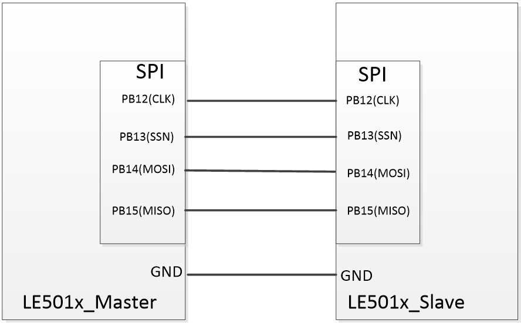

SPI设备使用示例
==================

根据目前SDK所支持的三种通信模式，提供了三种对应的SPI示例的路径如下：

阻塞模式：<install_file>/dev/examples/spi_test/spi_polling

非阻塞模式：<install_file>/dev/examples/spi_test/spi_it

DMA模式：<install_file>/dev/examples/spi_test/spi_dma

一、硬件外围连接:
------------------
SPI 使用示例需要主/从两个模块共同完成，示例演示主机模块和从机模块之间相互通信过程，推荐使用我司官方LE501x dongle 板加载示例验证。主从硬件连接方式如下：

一、示例介绍:
------------------
本示例主要用于演示凌思SOC芯片外设SPI的主/从应用，示例代码主要由以下部分组成：初始化、SPI发送/接收、接收数据判断及结果提示。

| 1)、 初始化：IO初始化、SPI初始化

IO初始化：数字复用IO支持管脚全映射，在这里我们选择PB12~PB15分别复用做为CLK、SSN、MOSI、MISO。

.. code ::   

    /* Configure the GPIO AF */	
    spi_clk_io_init(PB12);      /* CLK-------------PB12 */	
    spi_nss_io_init(PB13);      /* SSN-------------PB13 */
    spi_mosi_io_init(PB14);     /* MOSI------------PB14 */
    spi_miso_io_init(PB15);     /* MISO------------PB15 */

SPI初始化：用户在使用SPI外设前，必须对SPI模块参数进行必要的配置，以满足不同SPI外围设备的通信时序要求。

.. code ::   

    SpiHandle.Instance               = SPI2;
    SpiHandle.Init.BaudRatePrescaler = SPI_BAUDRATEPRESCALER_64;    //通信速率
    SpiHandle.Init.Direction         = SPI_DIRECTION_2LINES;        //通信方向
    SpiHandle.Init.CLKPhase          = SPI_PHASE_1EDGE;             //时钟相位
    SpiHandle.Init.CLKPolarity       = SPI_POLARITY_LOW;            //时钟极性
    SpiHandle.Init.DataSize          = SPI_DATASIZE_8BIT;           //数据位宽
    SpiHandle.Init.FirstBit          = SPI_FIRSTBIT_MSB;            //数据格式
    SpiHandle.Init.TIMode            = SPI_TIMODE_DISABLE;          //TI模式使能位
    SpiHandle.Init.NSS               = SPI_NSS_HARD_OUTPUT;         //CS脚控制方式
    SpiHandle.Init.Mode              = SPI_MODE_MASTER;             //SPI模式

| 2)、SPI发送/接收
    通过调用发送/接收接口API函数，并把发送或接收数据buf和长度传入接口函数（polling模式还需要传入超时时间），开始在通信线上发送或接收数据。

    polling模式：当发送或接收数据个数满足预定长度，即退出API函数，可通过函数返回值判断本次通信状态。

    IT模式：使用中断模式发送或接收数据，接口函数调用后会马上退出，可通过函数返回值判断本次通信状态，并在发送或接收数据长度满足预定大小时，驱动会通过回调函数通知应用。

    dma模式：使用dma模式发送或接收数据，操作和流程与IT模式相同，仅回调函数接口不一样。需要注意：dma模式使用的buf内存必须指定在dma特定RAM空间

| 3)、结果判断和提示
    SPI数据发送接收完成后，示例会对当前通信数据进行比对，如果从机接收到的数据和主机发送的数据一致，即在PB9 IO口输出500ms翻转信号（如使用dongle板，可看到蓝色LED持续闪烁）。

一、操作步骤:
------------------
SPI三个示例演示功能基本相同，可使用相同硬件和操作顺序，均演示主机发送数据，从机接收数据。这里以spi_polling为例。

| 1. 打开工程，熟悉功能结构和main.c文件中各个函数功能。
| 2. 在main.c中找到主从配置宏定义，如下。当主机程序时，使能该宏定义；当从机程序时，不使用该宏定义（双斜杠注释掉）。

.. code ::

    /* Uncomment this line to use the board as master, if not it is used as slave */
    #define MASTER_BOARD

| 3. 主从程序分别加载到对应硬件板子后，从机上电3s后，主机再上电。如果两端通信成功，可在dongle板上看到蓝色LED灯500ms间隔持续闪烁。