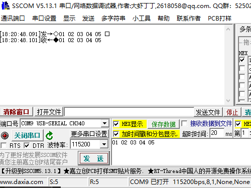

UART设备使用示例
==================

根据目前SDK所支持的三种通信模式，提供了三种对应的UART示例的路径如下：

阻塞模式：<install_file>/dev/examples/uart_test/uart_polling

非阻塞模式：<install_file>/dev/examples/uart_test/uart_it

DMA模式：<install_file>/dev/examples/uart_test/uart_dma

一、操作步骤:
-------------

三种示例的功能几乎都差不多，所以操作步骤基本上一样。

#. 先观察对应工程的代码，了解对应参数所代表的含义，其中阻塞模式下，设置了超时机制，超时时间默认是10s，可以自己更改和配置，然后进行编译。

#. 将编译好的程序下载到测试的模块中。

#. 将芯片的uart接口（程序中设置的IO是PB00\PB01）接到串口转接板的RX/TX上。同时两者的GND要接到一起。

#. 打开电脑端的串口调试工具，设置波特率为：115200 数据位：8  停止位：1 奇偶校验位：null。

#. 发送数据。

二、预期结果:
-------------

