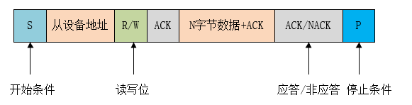

.. _i2c_ref:

I2C
==============

一、I2C简介
--------------

I2C（Inter Integrated Circuit）总线是 PHILIPS 公司开发的一种半双工、双向二线制同步串行总线。I2C 总线传输数据时只需两根信号线，一根是双向数据线 SDA（serial data），另一根是双向时钟线 SCL（serial clock）。SPI 总线有两根线分别用于主从设备之间接收数据和发送数据，而 I2C 总线只使用一根线进行数据收发。

I2C允许同时有多个主设备存在，每个连接到总线上的器件都有唯一的地址，主设备启动数据传输并产生时钟信号，从设备被主设备寻址，同一时刻只允许有一个主设备。

..  image:: i2c_01.png

当总线空闲时，SDA 和 SCL 都处于高电平状态，当主机要和某个从机通讯时，会先发送一个开始条件，然后发送从机地址和读写控制位，接下来传输数据（主机发送或者接收数据），数据传输结束时主机会发送停止条件。传输的每个字节为8位，高位在前，低位在后。数据传输过程中的不同名词详解如下所示：

开始条件： SCL 为高电平时，主机将 SDA 拉低，表示数据传输即将开始。
从机地址： 主机发送的第一个字节为从机地址，高 7 位为地址，最低位为 R/W 读写控制位，1 表示读操作，0 表示写操作。一般从机地址有 7 位地址模式和 10 位地址模式两种，如果是 10 位地址模式，第一个字节的头 7 位 是 11110XX 的组合，其中最后两位（XX）是 10 位地址的两个最高位，第二个字节为 10 位从机地址的剩下8位，如下图所示：

..  image:: i2c_03.png

应答信号： 每传输完成一个字节的数据，接收方就需要回复一个 ACK（acknowledge）。写数据时由从机发送 ACK，读数据时由主机发送 ACK。当主机读到最后一个字节数据时，可发送 NACK（Not acknowledge）然后跟停止条件。
数据： 从机地址发送完后可能会发送一些指令，依从机而定，然后开始传输数据，由主机或者从机发送，每个数据为 8 位，数据的字节数没有限制。
重复开始条件： 在一次通信过程中，主机可能需要和不同的从机传输数据或者需要切换读写操作时，主机可以再发送一个开始条件。
停止条件： 在 SDA 为低电平时，主机将 SCL 拉高并保持高电平，然后在将 SDA 拉高，表示传输结束。

二、I2c接口介绍
-----------------

2.1 初始化：
--------------

一般情况下 MCU 的 I2C 器件都是作为主机和从机通讯。
I2c初始化，首先需要定义好I2c的SDA与SCL的io口。

.. code ::

    void iic1_io_init(uint8_t scl,uint8_t sda);
    void iic2_io_init(uint8_t scl,uint8_t sda);

然后开始初始化I2c设备。在初始化时需要先把设备一些配置信息先填写完成，如下代码所示：

.. code ::

    HAL_I2C_Init(I2C_HandleTypeDef *hi2c);

如果初始化成功后便可以返回值为HAL_OK，否则为HAL_ERROR。

.. code ::

    typedef struct __I2C_HandleTypeDef
    {
    reg_i2c_t                	*Instance;      /*!< I2C registers base address               */

    I2C_InitTypeDef            Init;           /*!< I2C communication parameters             */

    uint8_t                    *pBuffPtr;      /*!< Pointer to I2C transfer buffer           */

    uint16_t                   XferSize;       /*!< I2C transfer size                        */

    uint16_t                  XferCount;       /*!< I2C transfer counter                     */

    uint32_t                  XferOptions;     /*!< I2C transfer options                     */

    uint32_t                  PreviousState;  /*!< I2C communication Previous state and mode
                                                    context for internal usage               */
    void                          *DMAC_Instance;
    union{
            struct I2cDMAEnv DMA;
            struct I2cInterruptEnv Interrupt;
    }Tx_Env,Rx_Env;                           /*!< I2C Tx/Rx DMA handle parameters             */

    HAL_LockTypeDef            Lock;           /*!< I2C locking object                       */

    HAL_I2C_StateTypeDef  State;          /*!< I2C communication state                  */

    HAL_I2C_ModeTypeDef   Mode;           /*!< I2C communication mode                   */

    uint32_t              ErrorCode;      /*!< I2C Error code                           */

    uint32_t              Devaddress;     /*!< I2C Target device address                */

    uint32_t              EventCount;     /*!< I2C Event counter                        */
    } I2C_HandleTypeDef;

.. note ::

 注：具有三种传输模式：标准模式传输速率为 100kbit/s ，快速模式为 400kbit/s ，高速模式下可达 3.4Mbit/s，但目前大多 I2C 设备尚不支持高速模式。

2.2 i2c收发：
--------------

**参数描述**

.. note ::

    #. hi2c：配置i2c参数 (Pointer to a I2C_HandleTypeDef structure that contains the configuration information for the specified I2C.)
    #. DevAddress：从设备地址(Target device address: The device 7 bits address value in datasheet must be shifted to the left before calling the interface)
    #. pData：保存数据位置指针(Pointer to data buffer)
    #. Size：发送或接收的数据量
    #. Timeout:  设置超时时间

2.2.1 轮询模式
......................

.. code ::

    HAL_I2C_Master_Transmit(I2C_HandleTypeDef *hi2c, uint16_t DevAddress, uint8_t *pData, uint16_t Size, uint32_t Timeout)
    /*主设备以轮询模式向从设备发送数据*/
    HAL_I2C_Master_Receive(I2C_HandleTypeDef *hi2c, uint16_t DevAddress, uint8_t *pData, uint16_t Size, uint32_t Timeout)
    /*主设备以轮询模式读取从设备的数据*/

2.2.2 中断模式
......................

.. code ::

    HAL_I2C_Master_Transmit_IT(I2C_HandleTypeDef *hi2c, uint16_t DevAddress, uint8_t *pData, uint16_t Size)
    /*主设备以中断的模式向从设备发送数据*/
    HAL_I2C_Master_Receive_IT(I2C_HandleTypeDef *hi2c, uint16_t DevAddress, uint8_t *pData, uint16_t Size)
    /*主设备以中断的模式读取从设备的数据*/

2.2.3 回调函数 
......................
.. code ::

    void HAL_I2C_MasterTxCpltCallback(I2C_HandleTypeDef *hi2c)
    {

    }
    void HAL_I2C_MasterRxCpltCallback(I2C_HandleTypeDef *hi2c)
    {	

    }
.. note ::
    
    | 在使用中断模式的时候，在执行发送与接受动作完成时会进相应的回调函数，这时候我们表示我们的数据已经发送或接收完成，现在可以进行下一步操作。
    | 这个函数属于弱定义，用户可以自行定义，并完成相应的逻辑处理。

2.3 反初始化
---------------

2.3.1 反初始化I2C模块
......................

    通过反初始化接口，应用程序可以关闭i2c外设，从而在运行BLE的程序的时候，降低系统的功耗。

.. code ::

    HAL_StatusTypeDef HAL_I2C_DeInit(I2C_HandleTypeDef *hi2c);
    /*如果初始化成功后便可以返回值为HAL_OK，否则为HAL_ERROR*/

2.3.2 反初始化I2C IO
.......................

    反初始化IO接口的主要目的是为了避免在进入低功耗模式时，IO上产生漏电，或者给对接设备发送不必要的数据。
    调用此接口后,会默认的将i2c的SDA与SCL配置成输入模式（IO浮空）。

.. code ::

    void iic1_io_deinit(void);
    void iic2_io_deinit(void);

.. note ::

    I2C初始化动作会向系统注册I2C进入工作状态，当系统检测到有任一外设处于工作状态时，都不会进入低功耗休眠。
    因此，I2C使用完毕，需要进入低功耗状态之前，必须反初始化I2C。