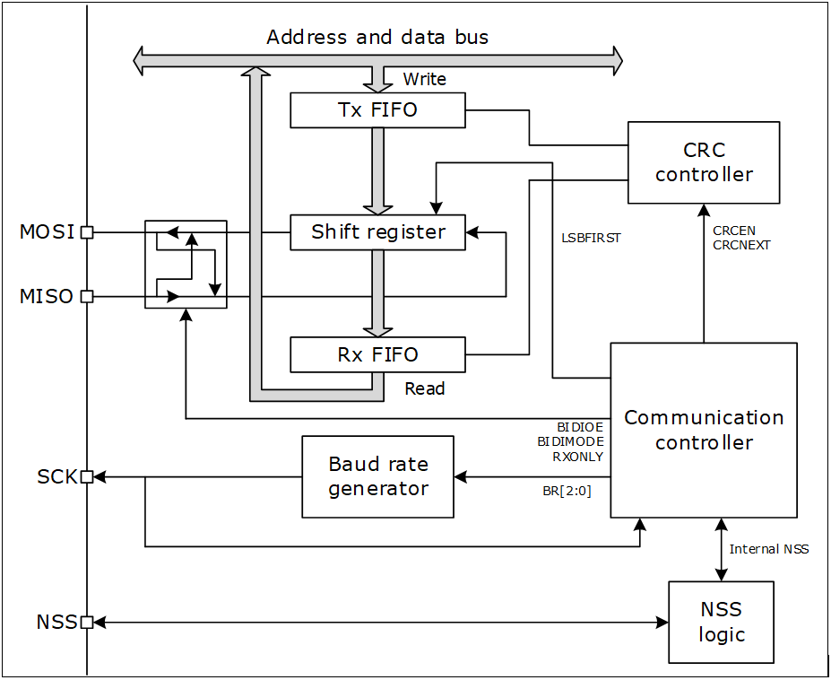

.. _spi_ref:

SPI
======

串行外设接口（SPI）协议，支持半双工，全双工和简单同步等方式与外部设备的串行通信。

SPI主要特性
>>>>>>>>>>>>>>

#. 主设备或从设备模式
#. 三线全双工同步传输
#. 两条线的半双工同步传输（双向数据线）
#. 两条线的简单同步传输（单向数据线）
#. 8位到16位数据的大小选择
#. 8个主模式波特率分频器。
#. 主机和从机模式下都可以由硬件或软件管理NSS：主/从模式操作的动态变化
#. 可编程时钟极性和相位
#. 高位在前或低位在前可设置
#. 专用的发送和接收状态标志，全部支持中断触发
#. SPI总线忙状态标志
#. 支持Rx和Tx FIFO，深度是16
#. 支持DMA传输
#. 支持SPI TI模式   

一、SPI模块初始化
-------------------

1.1 选择SPI模块的复用IO
........................

芯片支持该模块复用IO全映射，所以用户可以通过调用IO 的初始化接口，将任意IO配置CLK、MOSI、MISO、及NSS功能，与外围设备进行通信。

.. code ::

    void spi2_clk_io_init(uint8_t clk);
    void spi2_nss_io_init(uint8_t nss);
    void spi2_mosi_io_init(uint8_t mosi);
    void spi2_miso_io_init(uint8_t miso);

.. note ::

    SNN是SPI片选脚，当SPI为主机时，也可以用普通IO替代，如果工程师需要用IO功能替代时，可以不初始化该复用IO。

1.2 设置SPI模块参数
.....................

在使用SPI模块前，需要设置SPI模块的参数，其结构体的参数原型如下：

.. code ::

    typedef struct __SPI_HandleTypeDef
    {
        reg_spi_t                   *Instance;                 /*!< SPI registers base address               */
        SPI_InitTypeDef             Init;                      /*!< SPI communication parameters             */
        uint8_t                     *pTxBuffPtr;               /*!< Pointer to SPI Tx transfer Buffer        */
        uint16_t                    TxXferSize;                /*!< SPI Tx Transfer size                     */
        uint16_t              	    TxXferCount;               /*!< SPI Tx Transfer Counter                  */
        uint8_t                     *pRxBuffPtr;               /*!< Pointer to SPI Rx transfer Buffer        */
        uint16_t                    RxXferSize;                /*!< SPI Rx Transfer size                     */
        uint16_t              	    RxXferCount;               /*!< SPI Rx Transfer Counter                  */
        void (*RxISR)(struct __SPI_HandleTypeDef *hspi);       /*!< function pointer on Rx ISR               */
        void (*TxISR)(struct __SPI_HandleTypeDef *hspi);       /*!< function pointer on Tx ISR               */
        void                       *DMAC_Instance;
        union{
                struct SPI_DMA_Env DMA;
        }Tx_Env,Rx_Env;
        HAL_LockTypeDef             Lock;                      /*!< Locking object                           */
        HAL_SPI_StateTypeDef  	    State;                     /*!< SPI communication state                  */
        uint32_t              	    ErrorCode;                 /*!< SPI Error code                           */

    } SPI_HandleTypeDef;

SPI模块具体参数设置可参阅该模块lsspi.h文件。

1.3 初始化SPI模块
..................

通过初始化接口，实现用户对SPI模块进行参数配置。

.. code ::

    HAL_StatusTypeDef HAL_SPI_Init(SPI_HandleTypeDef *hspi);

如果初始化成功后便可以返回值为HAL_OK，否则为HAL_ERROR。

二、反初始化
--------------

2.1 反初始化SPI模块
......................

通过反初始化接口，应用程序可以关闭SPI模块，从而在运行BLE的程序的时候，降低系统的功耗。

.. code ::

    HAL_StatusTypeDef HAL_SPI_DeInit(SPI_HandleTypeDef *hspi);

2.2 反初始化复用IO
...................

反初始化IO接口的主要目的是为了避免在进入低功耗模式时，IO上产生漏电，或者给对接设备发送不必要的数据。
调用SPI IO反初始化接口后,会将SPI复用IO恢复回GPIO功能。

.. code ::

    void spi2_clk_io_deinit(void);
    void spi2_nss_io_deinit(void);
    void spi2_mosi_io_deinit(void);
    void spi2_miso_io_deinit(void);

.. note ::

    SPI初始化动作会向系统注册UART进入工作状态，当系统检测到有任一外设处于工作状态时，都不会进入低功耗休眠。
    因此，应用中如SPI使用完毕，需要进入低功耗状态之前，必须反初始化SPI。

三、SPI模块通信
---------------

#. 支持主机和从机两种模式；
#. 每种模式均支持 3 种通信方法：阻塞方式、非阻塞（中断）方式、DMA 方式。在使用的时候，这 3 种方式只能选其一。
#. 每种通信方式均支持单收、单发、收发同步接口。

3.1 阻塞方式
.............   

以阻塞方式使用SPI设备的API接口如下所示：

.. code ::

    HAL_StatusTypeDef HAL_SPI_Transmit(SPI_HandleTypeDef *hspi, uint8_t *pData, uint16_t Size, uint32_t Timeout);
    HAL_StatusTypeDef HAL_SPI_Receive(SPI_HandleTypeDef *hspi, uint8_t *pData, uint16_t Size, uint32_t Timeout);
    HAL_StatusTypeDef HAL_SPI_TransmitReceive(SPI_HandleTypeDef *hspi, uint8_t *pTxData, uint8_t *pRxData, uint16_t Size, uint32_t Timeout);

顾名思义，阻塞方式是指应用软件调用该接口后，CPU需要等待本次通信完成后才退出，会一定程度上降低CPU的利用率。

3.2 非阻塞（中断）方式
........................

以中断方式使用SPI设备的API接口如下所示：

.. code ::

    HAL_StatusTypeDef HAL_SPI_Transmit_IT(SPI_HandleTypeDef *hspi, uint8_t *pData, uint16_t Size);
    HAL_StatusTypeDef HAL_SPI_Receive_IT(SPI_HandleTypeDef *hspi, uint8_t *pData, uint16_t Size);
    HAL_StatusTypeDef HAL_SPI_TransmitReceive_IT(SPI_HandleTypeDef *hspi, uint8_t *pTxData, uint8_t *pRxData, uint16_t Size);

3.3 DMA方式
.............

以DMA方式使用SPI设备的API接口如下所示：

.. code ::

    HAL_StatusTypeDef HAL_SPI_Transmit_DMA(SPI_HandleTypeDef *hspi,void *Data,uint16_t Count);
    HAL_StatusTypeDef HAL_SPI_Receive_DMA(SPI_HandleTypeDef *hspi,void *Data,uint16_t Count);
    HAL_StatusTypeDef HAL_SPI_TransmitReceive_DMA(SPI_HandleTypeDef *hspi,void *TX_Data,void *RX_Data,uint16_t Count);

.. note ::

    DMA方式在使用时需要注意：DMA只支持访问特定的8Kram（0xa000~0xbFFF），所以，DMA使用的变量或数组必须指定在这8K内，建议用户在申请变量时加 DMA_RAM_ATTR 限定。例如：DMA_RAM_ATTR uint8_t aTxBuffer[BUFFERSIZE];
    

四、代码示例
----------------

示例代码请参阅下面章节：应用说明->SPI设备使用示例。    
