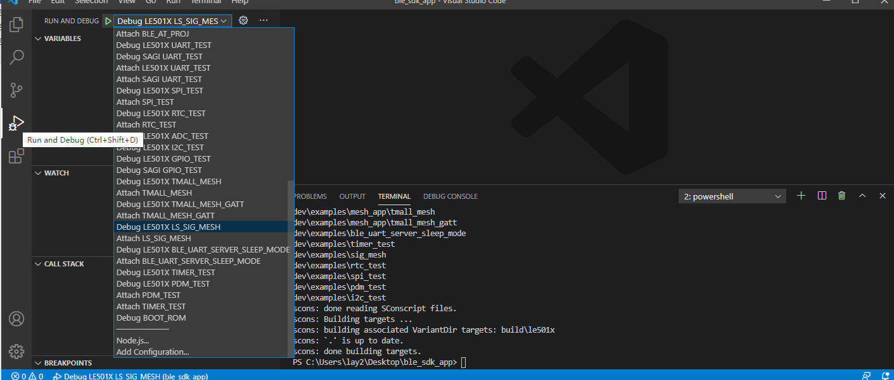

.. _env_setup:

软件开发环境搭建
================= 

我们支持如下开发环境：

#. Python 3 + MDK-KEIL

#. Python 3 + VS Code + GCC(ARM)

下载地址： 

`GCC(ARM) 9.2.1 20191025 <https://developer.arm.com/-/media/Files/downloads/gnu-rm/9-2019q4/gcc-arm-none-eabi-9-2019-q4-major-win32.zip?revision=20c5df9c-9870-47e2-b994-2a652fb99075&la=en&hash=347C07EEEB848CC8944F943D8E1EAAB55A6CA0BC>`_ 

`VS Code (64bit) <https://go.microsoft.com/fwlink/?Linkid=852157>`_ 

`Python 3.8.2 (64bit) <https://www.python.org/ftp/python/3.8.2/python-3.8.2-amd64.exe>`_

`MDK_KEIL <http://www.keil.com/fid/qtcbv3wb9c9j1wrdw6w1a24gf9liqqd1ig1yd1/files/umdkarm/MDK525.EXE>`_

SDK 下载链接：

`gitee <https://gitee.com/linkedsemi/ls_ble_sdk>`_  

`github <https://github.com/linkedsemi/ls_ble_sdk>`_

一、MDK-KEIL
-------------------------

1. keil版本需要安装5.25以上,或者直接使用我们链接提供的版本， **不建议使用5.29以上版本**

2. 打开下载的 `ls_ble_sdk <https://gitee.com/linkedsemi/ls_ble_sdk>`_ 目录，将当前目录下的 ``tools\prog\LinkedSemi\le501x_flash_algo.elf`` 文件复制一份并修改文件名为le501x_flash_algo.FLM,并将le501x_flash_algo.FLM文件拷贝到keil安装目录下的 ``ARM\Flash`` 路径中 

3. 将fromelf执行文件的所在路径添加系统环境变量中，重启keil生效，该文件所在路径在keil的安装目录下面 ``Keil_v5\ARM\ARMCC\bin`` ，否则在使用keil编译时会报“fromelf不是内部或外部命令，也不是可运行的程序或批处理文件”的警告。（ `如何设置添加环境变量 <https://jingyan.baidu.com/article/47a29f24610740c0142399ea.html>`_ ） 

 .. image:: AddFromelf.png

二、Python 3 + VS Code + GCC(ARM)
-----------------------------------

* 解压GCC，将 ``{GCC_SETUP_DIR}/bin`` 路径添加到系统环境变量PATH中

* 安装Python 3(勾选安装pip模块、添加Python到PATH)、VS Code

安装 Python 相关详细说明
++++++++++++++++++++++++

    1. 勾选 Add Python 3.8 to PATH，然后选择 Customize install 开始安装

    .. image:: python_01.png

    2. 确认 pip 模块已经被勾选，其它配置默认就行，然后点击 Next 进行下一步

    .. image:: python_02.png

    3. 点击 Install 等待安装完成

    4. `以系统管理员身份打开命令行 <https://jingyan.baidu.com/article/f0e83a255d020522e4910155.html>`_ ，然后切换到SDK根下目录，例如SDK下载在D盘下 ``D:\ls_ble_sdk`` ,首先在CMD界面内输入 ``D:`` 切换到D盘，然后再使用 ``cd ls_ble_sdk`` 进入到SDK根目录里

    .. image:: cmd_01.png

* 进入SDK根目录，以系统管理员身份打开命令行，执行下述命令，安装Python依赖库::

    pip install -r requirements.txt
  
  如果下载速度比较慢导致下载失败，请尝试更换国内pip源，或者使用以下命令::
   
   pip install -r requirements.txt -i https://pypi.tuna.tsinghua.edu.cn/simple

* 用VS Code打开SDK目录，点击左侧Extensions（快捷键 ``Ctrl + Shift + X`` ），在搜索框输入 ``@recommended`` ,安装所有Workspace Recommendations插件

三、离线安装Python3+VS Code+GCC(ARM)
------------------------------------

.. _header-n116:

安装工具
--------------

.. _header-n117:

python相关的工具
++++++++++++++++++++

-  python3

      python-3.8.5.exe

-  Scons

      SCons-4.1.0.post1-py3-none-any.whl

-  ecdsa

      ecdsa-0.16.1-py2.py3-none-any.whl

-  intelhex

      intelhex-2.3.0-py2.py3-none-any.whl

.. _header-n135:

VSCODE相关工具
++++++++++++++++++++

-  vscode工具

      VSCodeUserSetup-x64-1.55.2.exe

-  vscode插件

   -  arm插件

         dan-c-underwood.arm-1.5.0.vsix

   -  Cortex_Debug插件

         marus25.cortex-debug-0.3.12.vsix

   -  C/C++插件

         ms-vscode.cpptools-1.3.1.vsix

   -  链接脚本插件

         ZixuanWang.linkerscript-1.0.1.vsix

.. _header-n160:

安装步骤
-------------

.. _header-n161:

1. 安装python3
+++++++++++++++++

.. image:: python_01.png

安装过程中建议勾选Add Python 3.8 to
PATH，省去后续系统环境的添加。后续一直next，直到安装完成。

.. _header-n164:

2. 检测python安装是否成功
+++++++++++++++++++++++++++++

上图表示，安装Python3已成功。

上图表示，安装pip已成功。

.. _header-n169:

3. 安装python3 插件
+++++++++++++++++++++++++

-  在插件所在的文件夹下，cmd命令

-  pip分别安装以下插件

.. _header-n179:

4. vscode 安装
++++++++++++++++++

直接运行安装VSCodeUserSetup-x64-1.55.2.exe

安装完成界面

.. _header-n183:

5. 安装vscode插件
++++++++++++++++++++++

-  找到Vscode安装目录，把vscode插件全部复制到vscode安装目录下的bin文件夹下。

-  在插件所在的文件夹下，cmd命令

-  显示插件安装成功

.. _header-n198:

6. JLink安装目录添加Linkedsemi相关文件
++++++++++++++++++++++++++++++++++++++++

其中
LinkedSemi文件夹和JLinkDevices.xml在SDK目录，可以复制添加到JLink目录下。

.. _header-n203:

7. 添加gcc-arm环境变量和Jlink环境变量
+++++++++++++++++++++++++++++++++++++++

解压gcc-arm-none-eabi-9-2019-q4-major-win32.zip，并把解压后的文件夹目录下的bin添加到PC系统环境变量中。

.. _header-n206:

安装完成
---------------------

.. _header-n207:

1. scons 编译SDK工程
++++++++++++++++++++++++

.. _header-n210:

2. 选择debug的相关示例
+++++++++++++++++++++++++++

.. _header-n214:

3. 启动debug模式
++++++++++++++++++++++

.. _header-n216:

*注：离线安装包请联系我们*
