======================
硬件开发使用手册 
======================

--------------
一、 芯片简介 
--------------

+++++++++++++
1.1 功能介绍
+++++++++++++

LE5010芯片支持SIG MESH，天猫MESH和私有MESH，供电电压在1.8V-3.6V，可以使用干电池或者对应电压的锂电池供电。

+++++++++++++++
1.2 引脚定义图
+++++++++++++++

*QFN32*

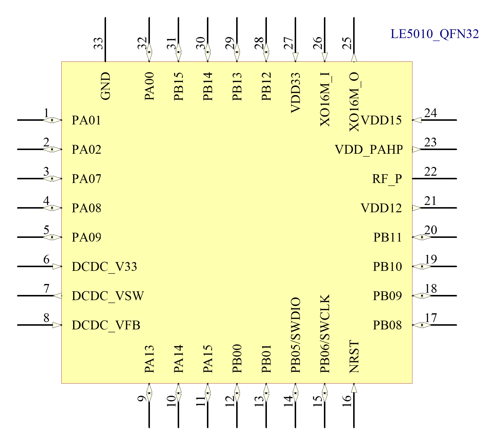

GPIO 具有全功能映射，且映射成数字功能的电平跟随系统输入电压。

QFN32管脚定义：

========  ========  =======
引脚编号   名称     功能
========  ========  =======
1         PA01       IO /ADC5
2         PA02       IO /ADC6
3         PA07       IO /WKUP
4         PA08       IO
5         PA09       IO
6         DCDC_V33   Buck 3.3V电源输入
7         DCDC_VSW   Buck SW输出
8         DCDC_VFB   Buck 反馈电压
9         PA13       IO
10        PA14       IO
11        PA15       IO
12        PB00       IO /UART1_TX
13        PB01       IO /UART1_RX
14        PB05       IO /SWDIO
15        PB06       IO /SWCLK
16        NRST       复位引脚
17        PB08       IO
18        PB09       IO
19        PB10       IO
20        PB11       IO /WKUP
21        VDD12      1.2V电源
22        RF_P       射频引脚
23        VDD_PAHP   PAHP电源 1_
24        VDD15      1.5V电源输入
25        XO16M_O    16M晶振输出
26        XO16M_I    16M晶振输入
27        VDD33      3.3V供电电源
28        PB12       IO /ADC0
29        PB13       IO /ADC1
30        PB14       IO 
31        PB15       IO /WKUP
32        PA00       IO /ADC4 /WKUP
33        GND        地
========  ========  =======

**注：**  

_`1`、PAHP电源，TX功率大于10dBm时，需要在VDD_PAHP(PIN23)外部添加一个1uF的滤波电容

*QFN48*

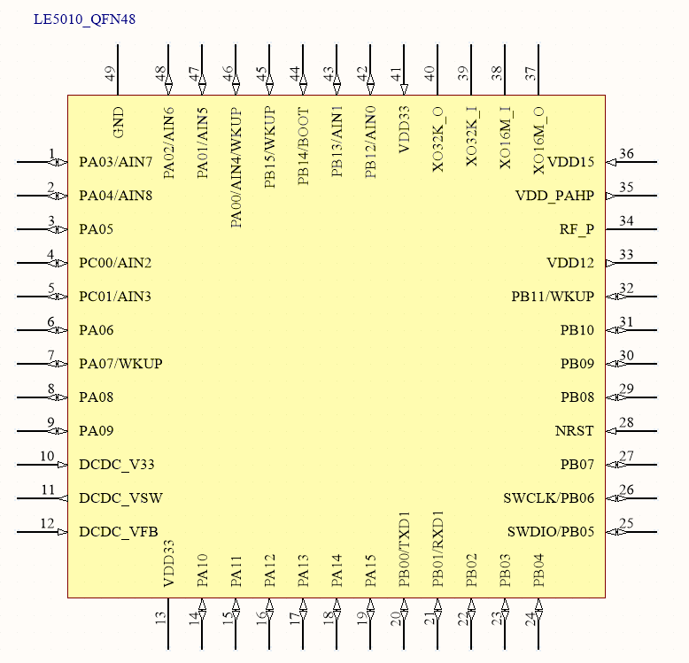

GPIO 具有全功能映射。

QFN48管脚定义：

========  ========  =======
引脚编号   名称     功能
========  ========  =======
1         PA03       IO /ADC7
2         PA04       IO /ADC8
3         PA05       IO 
4         PC00       IO /ADC2
5         PC01       IO /ADC3
6         PA06       IO
7         PA07       IO /WKUP
8         PA08       IO
9         PA09       IO
10        DCDC_V33   Buck 3.3V电源输入
11        DCDC_VSW   Buck SW输出
12        DCDC_VFB   Buck 反馈电压
13        VDD33      3.3V电源输入
14        PA10       IO 
15        PA11       IO 
16        PA12       IO 
17        PA13       IO 
18        PA14       IO 
19        PA15       IO 
20        PB00       IO /UART1_TX
21        PB01       IO /UART1_RX
22        PB02       IO
23        PB03       IO
24        PB04       IO
25        PB05       IO /SWDIO
26        PB06       IO /SWCLK
27        PB07       IO 
28        NRST       芯片复位引脚
29        PB08       IO
30        PB09       IO
31        PB10       IO
32        PB11       IO /WKUP
33        VDD12      1.2V 电源 
34        RF_P       射频引脚 
35        VDD_PAHP   PAHP电源 2_
36        VDD15      1.5V电源
37        XO16M_O    16M晶振输出
38        XO16M_I    16M晶振输入
39        XO32K_I    32.768K晶振输入
40        XO32K_O    32.768K晶振输出
41        VDD33      3.3V电源输入
42        PB12       IO /ADC0
43        PB13       IO /ADC1
44        PB14       IO /BOOT控制
45        PB15       IO /WKUP
46        PA00       IO /WKUP /ADC4
47        PA01       IO /ADC5
48        PA02       IO /ADC6
49        GND        地
========  ========  =======

**注：**  

_`2`、PAHP电源，TX功率大于10dBm时，需要在VDD_PAHP(PIN23)外部添加一个1uF的滤波电容

*SOP16*

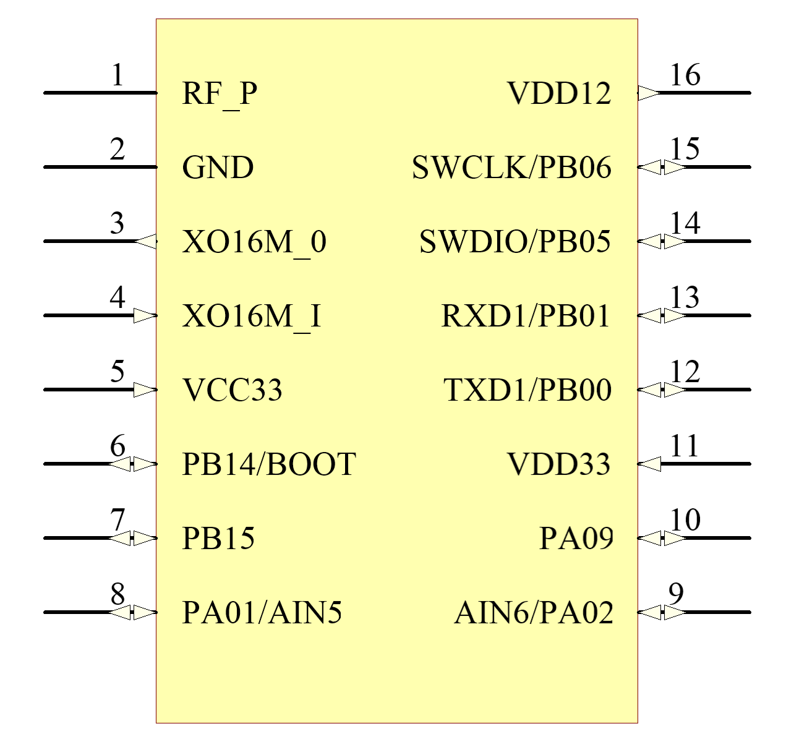

GPIO 具有全功能映射。

SOP16管脚定义：

========  ========  =======
引脚编号   名称      功能
========  ========  =======
1         RF_P       射频引脚
2         GND        地
3         XO16M_O    晶振接口
4         XO16M_I    晶振接口
5         VDD33      3.3V电源输入
6         PB14       IO
7         PB15       IO /WKUP
8         PA01       IO /ADC5
9         PA02       IO /ADC6        
10        PA09       IO
11        VDD33      3.3V电源输入
12        PB00       IO /UART1_TX
13        PB01       IO /UART1_RX
14        PB05       IO /SWDIO
15        PB06       IO /SWCLK
16        VDD12      1.2V电源
========  ========  =======

-------------------
二、参考系统设计
-------------------

QFN32原理图(1)

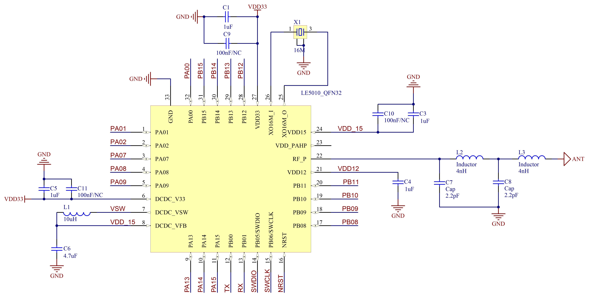

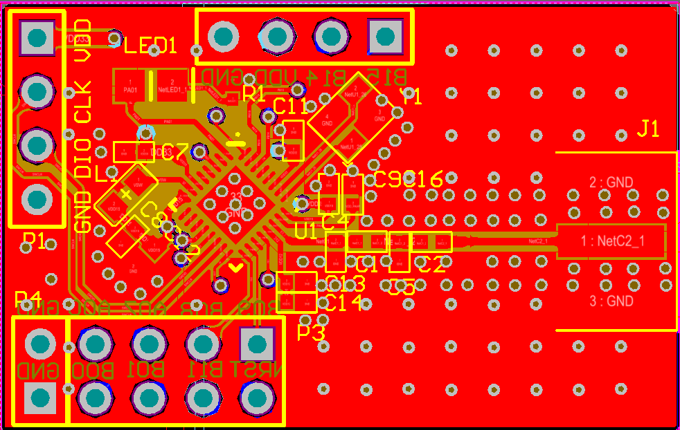

**注：**

| *1、 NRST为复位引脚，低电平复位，复位后需要将其释放，芯片才能正常工作*
| *2、 PB00和 PB01上电后默认为 UART1的 TX、RX接口，可在程序中更改功能*
| *3、 在使用 UART烧录时，需要将 PB14强制拉高*
| *4、匹配电路数值仅供参考，需针对不同的PCB进行微调*
| *5、容值较小的电容需要更靠近芯片的PIN脚，同时电源线需要尽量避开PWM信号线*

BOM表：

==================  ================================      =======  =======
位号                       封装规格                         数量     备注
==================  ================================      =======  =======
U1                      LE5010(QFN32 4*4)                  1       LE5010 凌思微电子
Y1                      16MHZ 10PPM 9pF/3225               1       （推荐）SX32Y016000L91T-UZ 泰晶
C6                      (±10%)/10V/4.7uF/0402              1 
C1、C2、C3、C4、C6       (±10%)/10V/1uF/0402                4 
C9、C10、C11            (±10%)/10V/100nF/0402               3
L1                      (±10%)/100mA/10uH/0603             1 
C7、C8                  (±10%)/10V/2.2pF/0402              2
L2、L3                  (±0.3nH)/1A/4nH/0402               2
==================  ================================      =======  =======

QFN32原理图(2)

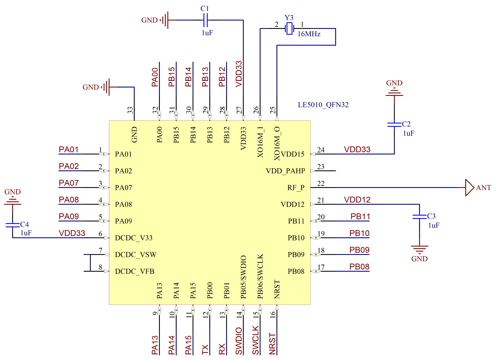

**注：**

| *1、 NRST为复位引脚，低电平复位，复位后需要将其释放，芯片才能正常工作*
| *2、 PB00和 PB01上电后默认为 UART1的 TX、RX接口，可在程序中更改功能*
| *3、在使用 UART烧录时，需要将 PB14强制拉高*
| *4、匹配电路数值仅供参考，需针对不同的PCB进行匹配*
| *5、容值较小的电容需要更靠近芯片的PIN脚，同时电源线需要尽量避开高频信号线*

BOM表：

================  ================================      =======  =======
位号                       封装规格                       数量     备注
================  ================================      =======  =======
U1                      LE5010(QFN32 4*4)                  1     LE5010 凌思微电子
Y1                      16MHZ 10PPM 9pF/3225               1     （推荐）SX32Y016000L91T-UZ 泰晶
C1、C2、C3、C4          (±10%)/10V/1uF/0402                4 
================  ================================      =======  =======

QFN48原理图

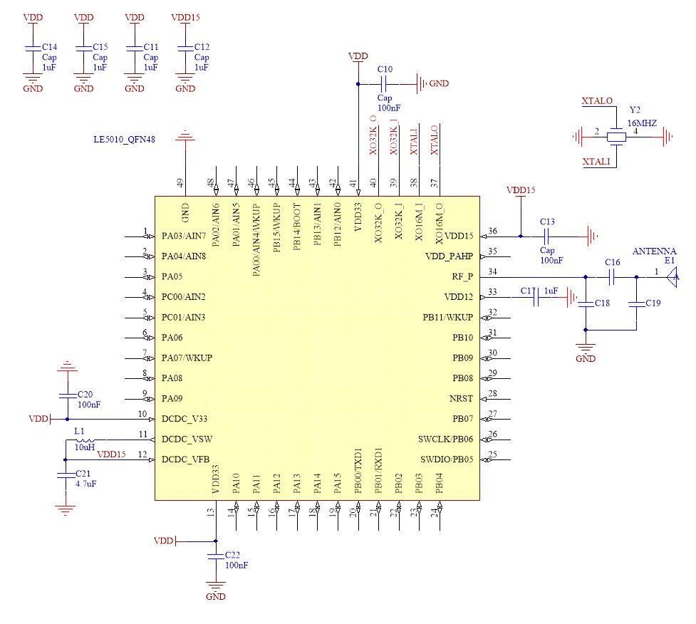

**注：**

| *1、 NRST为复位引脚，低电平复位，复位后需要将其释放，芯片才能正常工作*
| *2、 PB00和 PB01上电后默认为 UART1的 TX、RX接口，可在程序中更改功能* 
| *3、 在使用 UART烧录时，需要将 PB14强制拉高*
| *4、匹配电路数值仅供参考，需针对不同的PCB进行微调*
| *5、容值较小的电容需要更靠近芯片的PIN脚，同时电源线需要尽量避开PWM信号线*

BOM表：

==================      ================================           =======  =======
位号                         封装规格                                 数量     备注
==================      ================================           =======  =======
U1                        LE5010(QFN32 4*4)                          1        LE5010 凌思微电子
Y2                        16MHZ 10PPM 9pF/3225                       1       （推荐）SX32Y016000L91T-UZ 泰晶
Y1                        32KHZ 10PPM 9pF/3225                       1     
C5                        (±10%)/10V/4.7uF/0402                      1 
C10、C13、C20、C22         (±10%)/10V/100nF/0402                      4 
C11、C12、C14、C15         (±10%)/10V/1uF/0402                        4 
L1                        (±10%)/100mA/10uH/0603                     1 
==================      ================================           =======  =======

SOP16原理图

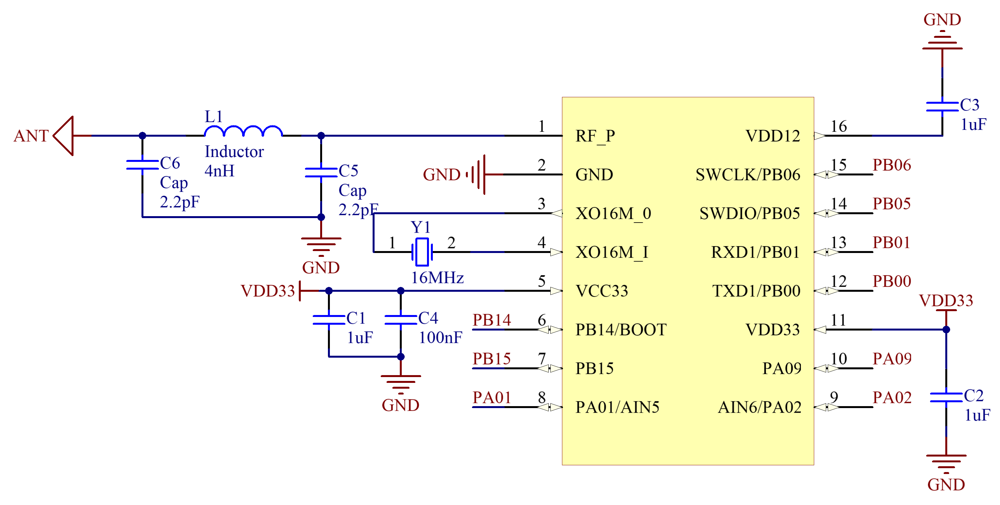

**注：** 

| *1、 PB00和 PB01上电后默认为 UART1的 TX、RX接口，可在程序中更改功能*
| *2、 在使用 UART烧录时，需要将 PB14强制拉高*
| *3、 PIN5和PIN11都必须外接3.3v电源，但在接线时不能直接短接，中间的线路必须先经过电容，在接入PIN脚*
| *4、 匹配电路的数值仅供参考，具体数值需要根据不同的PCB进行匹配*

BOM表：

================  ================================      =======      ==========
位号                       封装规格                       数量         备注
================  ================================      =======      ==========
U1                      LE5010(SOP16)                      1         LE5010 凌思微电子
Y1                      16MHZ 10PPM 9pF/3225               1         （推荐）SX32Y016000L91T-UZ 泰晶
C1、C2、C3              (±10%)/10V/1uF/0402                3
C4                      (±10%)/10V/100nF/0402              1
L1                      (±0.3nH)/1A/4nH/0402               1
C5、C6                   (±10%)/10V/2.2pF/0402             2
================  ================================      =======      ==========

-----------------------------
三、LE5010/5110 PCB注意事项
-----------------------------

.. toctree::
    :maxdepth: 1
   
    PCB注意事项.rst

-------------------
四、封装尺寸
-------------------

外形尺寸：

**QFN48尺寸图**

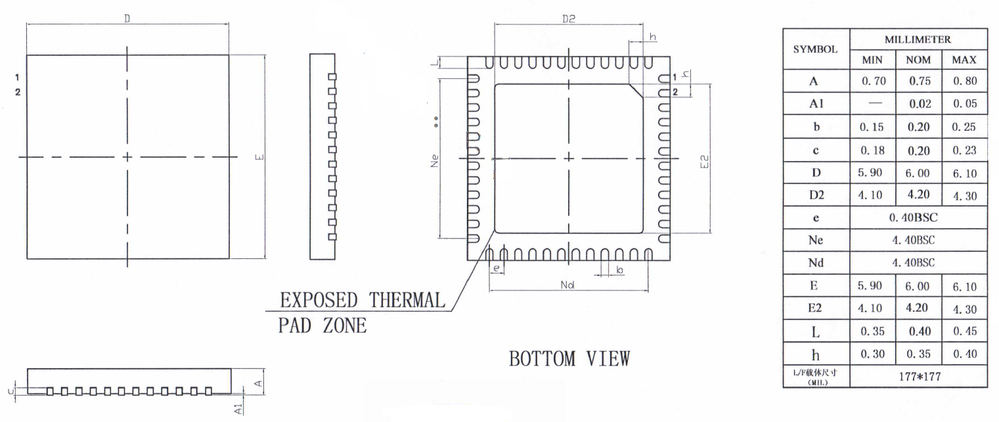

**QFN32尺寸图**

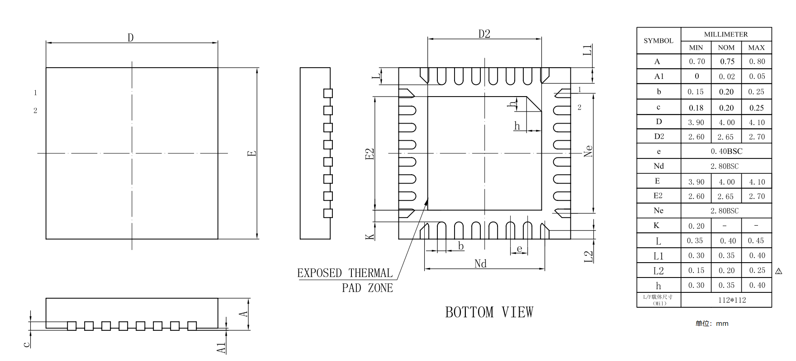

**SOP16尺寸图**

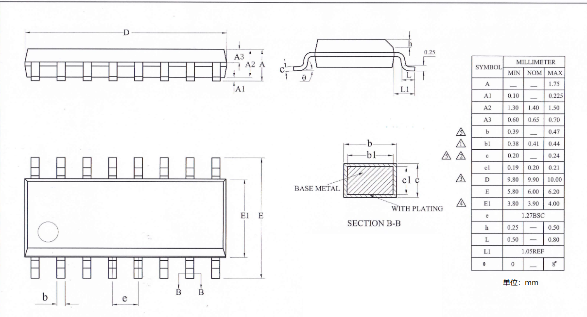

各种封装原理图和PCB参考示例可以从百度网盘里面下载：

链接：https://pan.baidu.com/s/1iPL2JWaDdYJRqNdGMwiK6w 

提取码：ijvd 

 