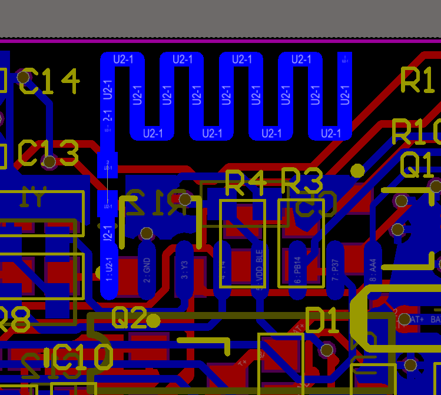

========================
LE5010/5110 PCB注意事项 
========================

    ..  image:: 天线布局注意事项.png

一、天线注意事项
------------------

    ..  image:: PCB布局1.png

.. note ::

    1、使用板载天线的时候，必须要求留足够的净空区，且在净空区中不能有其他的元器件或者覆铜。

    2、设计匹配电路的时候，尽量紧靠，天线与芯片的直接距离尽量近，且走线直、短。

1.1 上图的错误点：

(1)：天线的净空区不够，且有走线，走线会吸收掉部分辐射出来的信号，导致天线的辐射效率变低。

(2)：天线到芯片的PIN走线下方有许多杂线，会干扰射频的工作，导致发射出来无线信号质量差。

(3)：没有做匹配电路，只预留了一个电阻为作为测试点，最小的匹配电路为L型的电路，单个器件调节阻抗能力有限，很难达到理想的效果。

(4)：由于空间问题，没有留下足够的地，可能导致驻波比很差。

1.2 匹配电路布局注意事项

    ..  image:: 天线布局规范2.png

上述两幅图的主要问题是在匹配电路上面，图1匹配不够紧靠，会导致走线的阻抗不连续，增加了后续匹配的复杂度。图2出现了如果树木枝桠的走线，称为stub，一旦形成stub，阻抗一定是不连续，无论是天线或者其他场景的布局走线中，一定要避免出现这种情况。

二、电源的注意事项
-------------------

2.1 QFN32和SOP16的封装都有两个3.3V的电源输入，在靠近电源pin脚的位置上面，需要各自放一个对地电容，再接线进入PIN脚。如果有过孔，要尽量避免电容出现stub的情况，中间需要经过对地的电容，进行滤波处理，再进入目标的电源PIN脚，防止产生串扰影响。

2.2 电源在进入PIN脚之前，一定要有对地的电容滤波，且经过电容后，直接进入对应的PIN，如果是2层板，有高频信号线与电源线相交，需再增加一个对地电容，然后再接入对应的电源引脚。

2.3 QFN48上面有3个电源引脚，处理时，电源网络尽量星型分布，同时产生的环路尽量小。

    ..  image:: 天线布局规范3.png

三、DCDC电路
---------------

3.1 DCDC电路的主要结构如下所示：SW为方波输出信号，经过LC滤波之后，稳定在1.5V左右，给VDD15供电。

    ..  image:: DCDC电路.png

3.2):SOP16封装默认没有DCDC的PIN脚，QFN32和QFN48封装的DCDC电路可以忽略，只要将对应的VFB和SW短接，同时VDD15接3.3V电源输入即可。

四、地的覆铜
----------------

(4.1):针对QFN32和QFN48的封装的背面，一定要和PCB的GND连接在一起，形成回路。

(4.2):PCB布局的背面，尽量保证完整的地，不能出现死铜。

(4.3):天线与芯片的PIN脚连接下方的地必须完整，不能有走线，或者其他东西，连接线周围也是同理，而且面积越大越好。